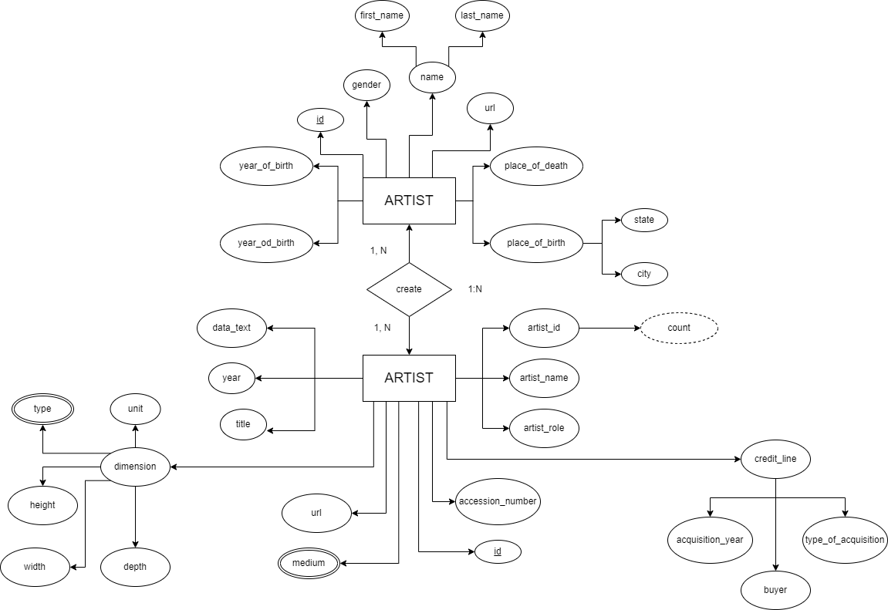

# Database-Project

## About the project
This organization represent the project for "Basi di Dati" course of Università degli Studi di Ferrara by the two students [Nicola Ricci Maccarini](https://github.com/nicolariccimaccarini) and [Andrea Casagrande](https://github.com/casagra]).
The goal is to develop a simple website (more than a website we can call it a set of web pages) wich interfaces with a museum's database using HTML, CSS, PHP, MySQL and Python.

## How to setup the repository
```zsh
$ git clone https://github.com/Database-Course-Project-UNIFE/Database-Project
$ cd Database-Project
$ python3 -m venv .
$ source bin/activate
$ pip3 install -r requirements.txt
```

## How we built this project
### Step 1: ER diagram
- We drew an ER Diagram for the museum's database:


### Step 2: Data Cleaning
- We took the raw data stored in the files `artist_data.csv` and `artworks_data.csv`
- We cleaned this files whit a Python script that using Pandas 
- At the end of the cleaning process, we save the two cleaned files in the following files `cleaned_artist_data.csv` and `cleaned_artwork_data.csv` 

### Step 3: Create the MySQL Database
- You can create a database using MySQL Workbench or via terminal
- We created the database via terminal using this simple commands:
```zsh
$ mysql -u username -p 
mysql> CREATE SCHEMA Museo;
mysql> USE Museo;
```
