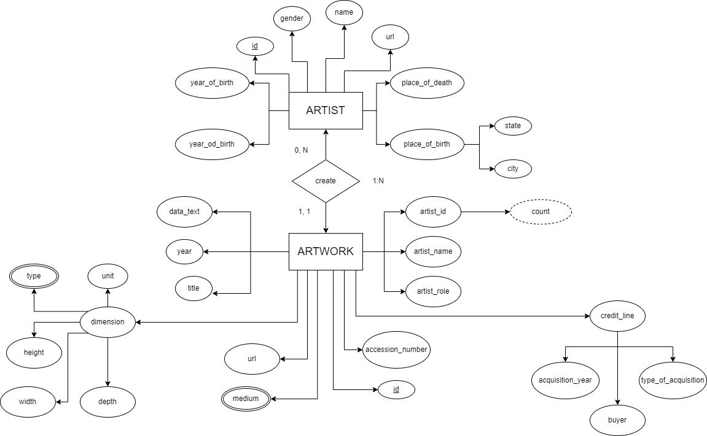

# Database-Project

## About the project
This organization represent the project for "Basi di Dati" course of Università degli Studi di Ferrara by the two students [Nicola Ricci Maccarini](https://github.com/nicolariccimaccarini) and [Andrea Casagrande](https://github.com/casagra]).
The goal is to develop a simple website (more than a website we can call it a set of web pages) wich interfaces with a museum's database using HTML, CSS, PHP, MySQL and Python.

## How to setup the repository
```zsh
$ git clone https://github.com/Database-Course-Project-UNIFE/Database-Project
$ cd Database-Project
$ python3 -m venv .
$ source bin/activate
$ pip3 install -r requirements.txt
```

## How we built this project
### Step 1: ER diagram
- We drew an ER Diagram for the museum's database:


### Step 2: Data Cleaning
- We took the raw data stored in the files `artist_data.csv` and `artworks_data.csv`
- We cleaned this files whit a Python script that using Pandas 
- At the end of the cleaning process, we save the two cleaned files in the following files `cleaned_artist_data.csv` and `cleaned_artwork_data.csv` 

### Step 3: Create the MySQL Database
- You can create a database using MySQL Workbench or via terminal
- We created the database via terminal using this simple commands:
```zsh
$ mysql -u username -p 
mysql> CREATE SCHEMA Museo;
mysql> USE Museo;
mysql> exit;
```

### Step 4: Create and Inizialize the Tables
- We have written a MySQL file for the creation of the two tables Artists and Artworks
- We also have written a php file to automate reading queries from `csv` files and inserting them into the database
- Artists Table:
```MySQL
CREATE TABLE Artists (
    id INTEGER NOT NULL,
    name VARCHAR(255) NOT NULL,
    gender CHAR NOT NULL,
    yearOfBirth CHAR(4) NOT NULL,
    yearOfDeath VARCHAR(4),
    birthCity VARCHAR(50),
    birthState VARCHAR(50),
    deatCity VARCHAR(50),
    deathState VARCHAR(50),
    url VARCHAR(255) NOT NULL,
    
    PRIMARY KEY (id)
);
```
- Artworks Table:
```MySQL
CREATE TABLE Artworks (
    id INTEGER NOT NULL,
    accession_number CHAR(6) NOT NULL,
    artist VARCHAR(100),
    artistRole VARCHAR(20),
    artistId INTEGER NOT NULL,
	title VARCHAR(2047),
    dateText VARCHAR(255),
    medium VARCHAR(255),
    creditLine VARCHAR(2047),
    year INTEGER,
    acquisitionYear INTEGER,
    types VARCHAR(100),
    width INTEGER,
    height INTEGER,
    depth DECIMAL(10,2),
    units CHAR(2),
    inscription VARCHAR(255),
    thumbnailCopyright VARCHAR(2047),
    thumbnailUrl VARCHAR(255),
    url VARCHAR(255),
    
    PRIMARY KEY (id)
);
```

- Artists Insert:
```MySQL
INSERT INTO Artists (id, name, gender, yearOfBirth, yearOfDeath, birthCity, birthState, deathCity, deathState, url)
                VALUES ('$id', '$name', '$gender', '$yearOfBirth', '$yearOfDeath', '$birthCity', '$birthState', '$deathCity', '$deathState', '$url')
```

- Artworks Insert:
```MySQL
INSERT INTO ARTWORKS (id, accession_number, artist, artistRole, artistId, title, dateText, medium, creditLine, year, acquisitionYear, 
                                  types, width, height, depth, units, inscription, thumbnailCopyright, thumbnailUrl, url)
            VALUES ('$id', '$accession_number', '$artist', '$artistRole', '$artistId', '$title', '$dateText', '$medium', '$creditLine', '$year'
                    '$acquisitionYear', '$types', '$width', '$height', '$depth', '$units', '$inscription', '$thumbnailCopyright', '$thumbnailUrl', '$url')";
```
